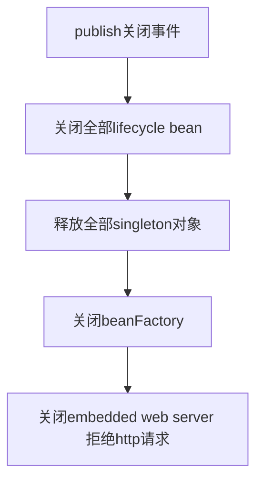

# Springboot-http-gracefully-closer

## 特别强调
> springboot 2.3.0+ 已原生支持优雅关闭, 该组件适用于2.3.0以下版本.
> 
> 请见[springboot优雅关闭](https://www.baeldung.com/spring-boot-web-server-shutdown)
> 实现方式: 将web容器注册为lifecycleBean, 前置web容器拒绝服务动作

### springboot web应用优雅关闭组件

>整合该组件后, springboot web应用在收到应用关闭信号时(kill/kill -15 TERM信号) 会拦截后续请求, 后续请求将会立刻返回HttpCode:503(服务不可用), 
>避免新请求申请已释放资源产生处理异常 (e.g 异常Singleton bean creation not allowed while singletons of this factory are in destruction )
>
>配合负载代理组件(e.g Nginx <b>proxy_next_upstream 模块</b>) http_503情况下 请求会平滑重路由到未关闭server, 做到滚动重启应用阶段用户请求无影响

### 场景:
> 部分互联网应用使用 nginx 直接负载 http应用, 在应用重启场景下客户端可能收到response:
> * code 5XX(自nginx端) 最初来自服务应用
> * http code 200但body中携带异常信息(服务节点重启阶段)=> case1: 服务关闭中请求进来 case2: 服务启动中请求进入 => 往往由全局异常处理器转换而来

### 原理(2.3.0前):
简单来讲, 整合spring-boot-starter-web的springboot应用在关闭时会经历:


核心代码: org.springframework.context.support.AbstractApplicationContext#doClose
```java
 // 只保留核心
  LiveBeansView.unregisterApplicationContext(this);
  publishEvent(new ContextClosedEvent(this));
  this.lifecycleProcessor.onClose();
  destroyBeans();
  closeBeanFactory();
  onClose();
```

>需要注意的是, 整合整合spring-boot-starter-web 模块的springboot应用, ServletWebServerApplicationContext 重写了 onClose() 函数, 并在函数中增加了关闭web server能力.
```java
protected void onClose() {
		super.onClose();
		stopAndReleaseWebServer();
	}
```
>Springboot-http-gracefully-closer 组件在感知ContextClosedEvent事件时, 所有后续http请求返回503,配合负载组件做到优雅平滑的应用滚动重启.


### 案例:
> nginx自带的[ngx_http_proxy_module](http://nginx.org/en/docs/http/ngx_http_proxy_module.html)中proxy_next_upstream提供了连接异常(e.g connection refuse/http code 503)场景下请求重路由(pass to next server)的能力 (请求打到其他节点).
> 
> 该框架配合proxy_next_upstream http_503(nginx上)配置, 在接受应用kill信号量时立即将应用设置为返回http code 503状态, 使nginx将请求能够顺利转发到其他未重启阶段的节点, 减少因服务器重启未成功处理在途请求的玄学问题.
>
> ps: 你可以发现nginx端收到error日志, 但是客户端上处理一切正常

[proxy_next_upstream配置文档](http://nginx.org/en/docs/http/ngx_http_proxy_module.html#proxy_next_upstream)
